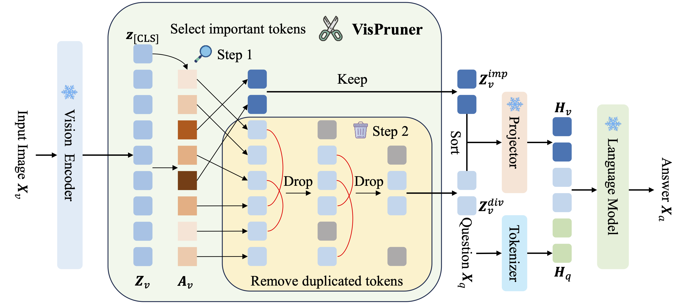
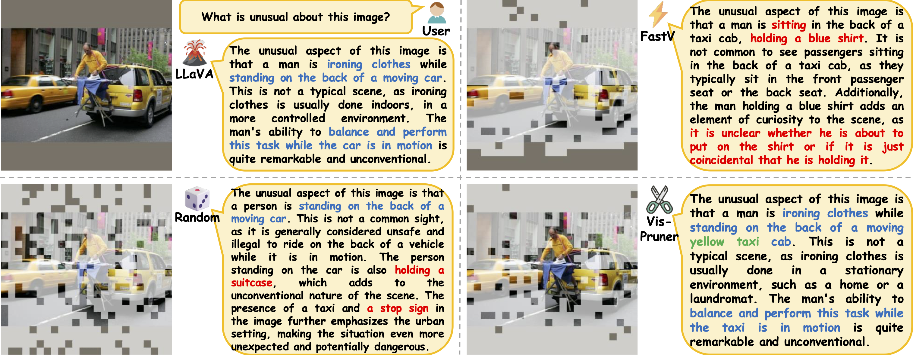

# ✂️ Beyond Text-Visual Attention: Exploiting Visual Cues for Effective Token Pruning in VLMs

*A plug-and-play method that utilizes visual cues for more effective token pruning in visual language models.*

## 👁️ Overview



In this work, we find that the **text-visual attention in the language model is not an ideal indicator for visual token pruning**. Based on the analysis, We propose **VisPruner**, a plug-and-play method that utilizes **visual cues** for more effective token pruning in visual language models. Specifically, we first use **visual attention** to select a limited number of **significant tokens**. Then, we remove duplicate tokens from the remaining ones based on their **similarity**. By retaining **diverse tokens** alongside the initially selected important tokens, we maximally preserve the visual information of the input image.



## ⚙️ Setup

### 🏝️ Environment

1. Clone this repository.
```bash
git clone https://github.com/anonymous-4869/VisPruner.git
cd VisPruner
```

2. Install necessary packages.
```bash
conda create -n vispruner python=3.10 -y
conda activate vispruner
pip install -e .
```

3. (Optional) Install FlashAttention for further inference acceleration.
```bash
pip install flash-attn --no-build-isolation
```

### 📦️ Model

Download corresponding [LLaVA](https://github.com/haotian-liu/LLaVA/blob/main/docs/MODEL_ZOO.md) checkpoints from [Hugging Face](https://huggingface.co/liuhaotian) 🤗:

| Version | LLM | Checkpoint |
|----------|:----------:|:-----------:|
| LLaVA-1.5 | Vicuna-7B | [liuhaotian/llava-v1.5-7b](https://huggingface.co/liuhaotian/llava-v1.5-7b) |
| LLaVA-1.5 | Vicuna-13B | [liuhaotian/llava-v1.5-13b](https://huggingface.co/liuhaotian/llava-v1.5-13b) |
| LLaVA-1.6 (LLaVA-NeXT) | Vicuna-7B | [liuhaotian/llava-v1.6-vicuna-7b](https://huggingface.co/liuhaotian/llava-v1.6-vicuna-7b) |
| LLaVA-1.6 (LLaVA-NeXT) | Vicuna-13B | [liuhaotian/llava-v1.6-vicuna-13b](https://huggingface.co/liuhaotian/llava-v1.6-vicuna-13b) |

### 📊 Data

Download each dataset according to [EVAL.md](EVAL.md).

## 📋️ Evaluation

The main implementation of VisPruner is highlighted with `VisPruner` annotations, mainly in [`llava_llama.py`](llava/model/language_model/llava_llama.py#L65), [`llava_arch.py`](llava/model/llava_arch.py#L143) and [`clip_encoder.py`](llava/model/multimodal_encoder/clip_encoder.py#L35).

We provide the evaluation scripts for each benchmark, you only need to set the remaining visual token number as the bash argument. For example, if you want to evaluate VisPruner with 128 visual tokens retained on the VQAv2 benchmark, you can run the script `./scripts/evaluate_vqav2.sh` with argument `128`:
```bash
CUDA_VISIBLE_DEVICES=0,1,2,3,4,5,6,7 bash scripts/v1_5/eval/vqav2.sh 128
```

And if you want to evaluate VisPruner with 64 visual tokens retained on the TextVQA benchmark, you can run the following command:
```bash
CUDA_VISIBLE_DEVICES=0 bash scripts/v1_5/eval/textvqa.sh 64
```

For evaluation with the 13B LLM, you just need to replace the `CKPT` argument from `llava-v1.5-7b` to `llava-v1.5-13b` in each script. 

The detailed guidance for evaluation commands and online submission of each benchmark can be found in [EVAL.md](EVAL.md).

## 🎟️ License

This project is released under the [Apache 2.0 license](LICENSE).

## 🎉 Acknowledgement

We appreciate the open-source efforts of [LLaVA](https://github.com/haotian-liu/LLaVA) and [FastV](https://github.com/pkunlp-icler/FastV).